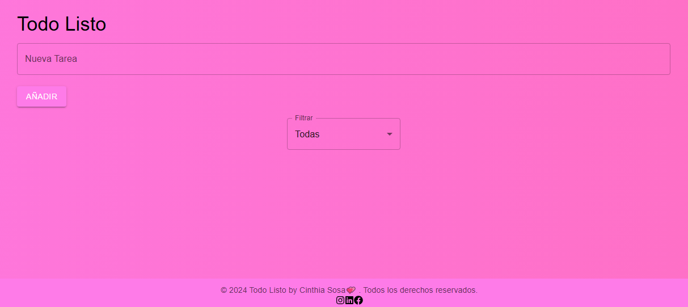
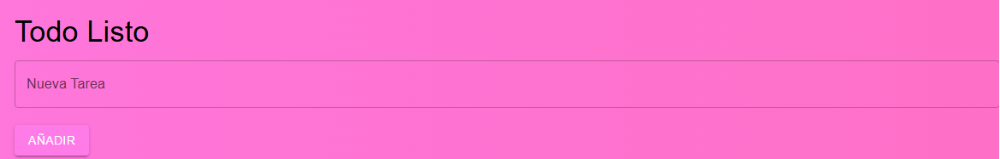
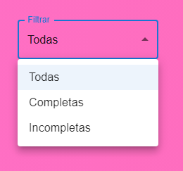

# Bienvenidos a mi App Todo listo 📝✨

**Todo Listo** es una aplicación de lista de tareas construida con **Vite** y **React**. Este proyecto utiliza Material UI para el diseño y estilos, y ofrece una experiencia intuitiva para gestionar tus tareas diarias.

## Despliegue en Vivo

Puedes ver la aplicación en funcionamiento aquí: [Todo Listo en Netlify](https://todolistotp.netlify.app/)

## Características

- **Agregar tareas:** Crea tareas con un solo clic.
- **Editar tareas:** Modifica tareas existentes directamente desde la lista.
- **Marcar como completadas:** Cambia el estado de tus tareas para organizarlas mejor.
- **Eliminar tareas:** Borra las tareas que ya no necesites.
- **Filtros dinámicos:** Muestra todas las tareas, solo las completadas o las incompletas.
- **Diseño limpio y moderno:** Estilizado con Material UI.

## Estructura del Proyecto

```plaintext
src/
├── components/
│   ├── filtros/    # Componente para gestionar filtros
│   ├── footer/     # Pie de página
│   ├── items/      # compinentes para editar y eliminar 
│   ├── filtros/    # Componente para gestionar filtros
│   ├── form/       # Componente para agregar tareas
│   ├── todolist/   # Lista de tareas con controles
├── App.css         # Estilos generales
├── App.jsx         # Componente principal
└── main.jsx        # Entrada principal

## Capturas de Pantalla

### Vista Principal


### Agregar una Tarea


### Uso de Filtros


Uso
Ingresa una nueva tarea en el formulario y agrégala a la lista.
Usa los botones disponibles para editar, eliminar o completar una tarea.
Filtra las tareas según tus necesidades: muestra todas, solo las completadas o solo las incompletas.

Tecnologías Utilizadas
Vite: Para un entorno de desarrollo rápido.
React: Biblioteca para construir interfaces de usuario.
Material UI: Biblioteca de componentes para diseño y estilo.
JavaScript (ES6+): Lenguaje principal para la lógica de la aplicación.

---

## Autor

Este proyecto fue desarrollado por [Cinthia Sosa](https://github.com/Ramlah23/Todo-Listo-TP-React.git) 🌟.  
¡Me encantaría saber tu opinión sobre el proyecto! Puedes contactarme en [cinthiainessosa@gmail.com].

## Agradecimientos

- A [Aldi mi profe preferida de programacion] por su apoyo.  
- A la comunidad de [ADA] por la documentación clara y útil.  

## Licencia

Este proyecto está bajo la Licencia MIT. Consulta el archivo [LICENSE](./LICENSE) para más detalles.

¡Gracias por usar Todo Listo! 📝✨


